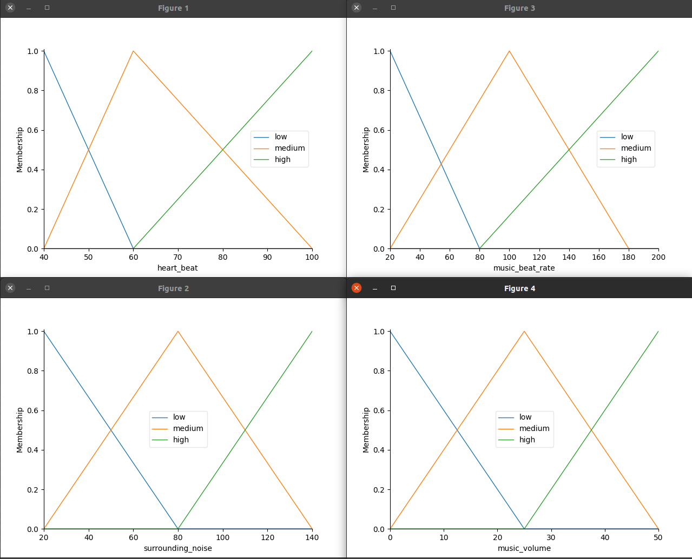
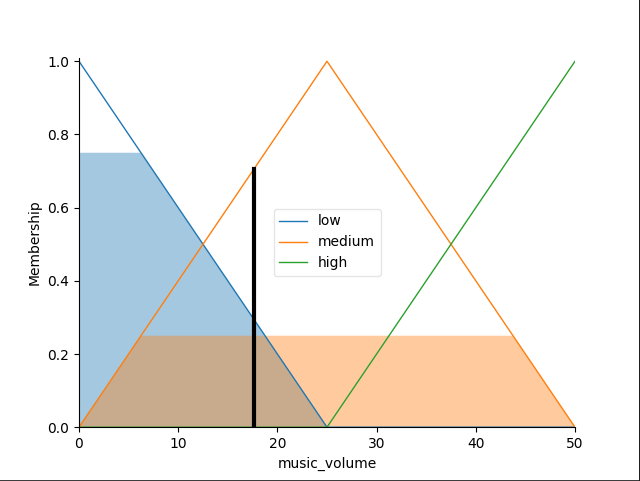
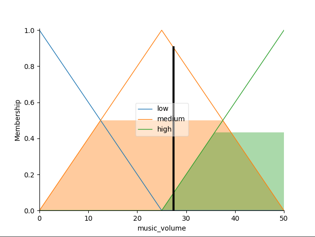

# Music player volume controller with fuzzy logic

The program is a fuzzy logic controller for a music player volume.  
It bases on 3 inputs:
- user heart beat as beat per minute,
- surrounding noise as decibels,
- music beat rate as beat per minute.
The output is music player volume as percentage of full music volume.

The system is desined for users listening to music while falling asleep.

## How to set up:
Please install skfuzzy with `pip3 install -U scikit-fuzzy`  
and matplotlib with `pip3 install matplotlib`

## How to run:
Please set the inputs in the last lines of the program:
- `music_volume_sim.input['heart_beat'] = <give_your_heart_beat>`
- `music_volume_sim.input['surrounding_noise'] = <give_surrounding_noise>`
- `music_volume_sim.input['music_beat_rate'] = <give_music_beat_rate>`

save and run the program with: `python3 music_volume_controller.py`

## Membership functions:


## Output examples:
**Example 1**:
```
music_volume_sim.input['heart_beat'] = 45
music_volume_sim.input['surrounding_noise'] = 40
music_volume_sim.input['music_beat_rate'] = 60
```

The output is: 17,66



**Example 2**:
```
music_volume_sim.input['heart_beat'] = 90
music_volume_sim.input['surrounding_noise'] = 106
music_volume_sim.input['music_beat_rate'] = 60
```

The output is: 27,38



## Authors:
Adam Łuszcz s22994  
Anna Rogala s21487

## Sources:
- scikit-fuzzy usage example from documentation: https://scikit-fuzzy.readthedocs.io/en/latest/auto_examples/plot_tipping_problem.html
- fuzzy logix project with scikit-fuzzy example: https://youtu.be/vG6aZEgbAVU?si=TvQR9F0Cez9TC_pG